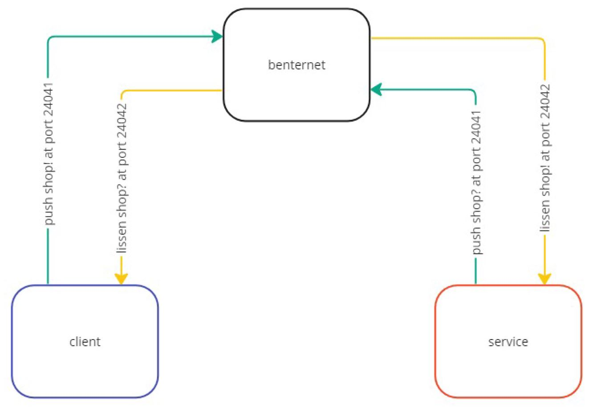
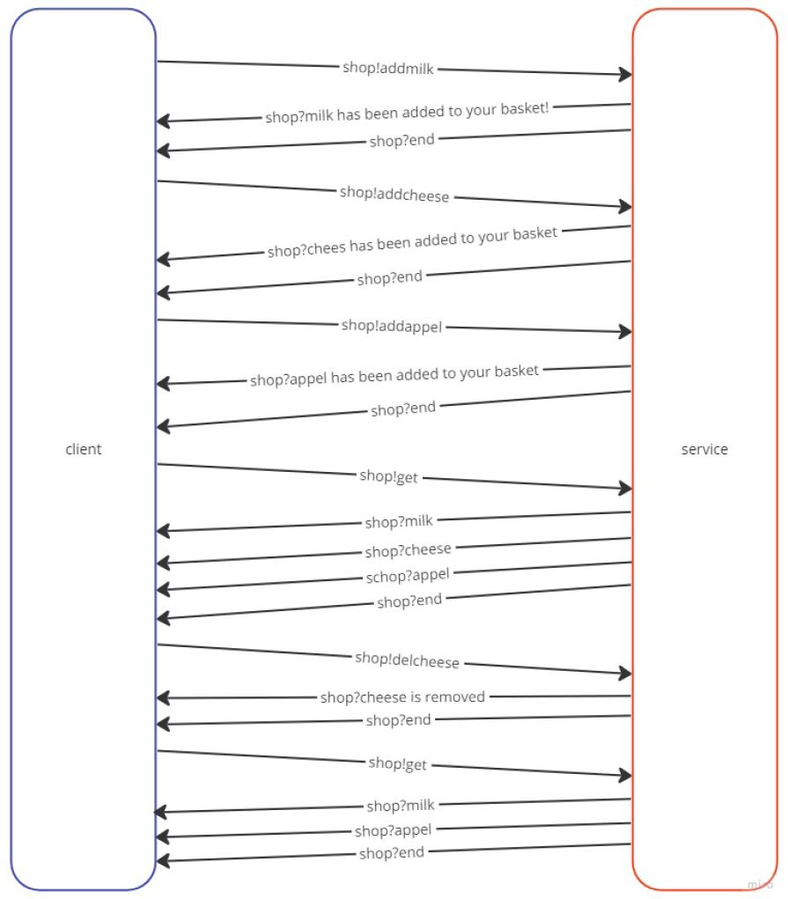

# NP_Service
In this readme you will find more information about the network service. It explains how the communication between the client and service works and how the program itself works.  

The program is written in [QT Creator](https://www.qt.io/product/development-tools), and the flowcharts are made on the website [miro.com](https://miro.com/templates/flowcharts/)

# Communication
in this project there are three applications: the [client](https://github.com/PhilippeArnaudHiroux/NP_Service/blob/main/Client/main.cpp), benternet and the [service](https://github.com/PhilippeArnaudHiroux/NP_Service/blob/main/Service/main.cpp). 
Below you can read how they communicate with each other. All communication is done with TCP protocol.

## Communication between client, benternet and service

### 1. Client to benternet
The client is what you operate as a user, in the client you can give your commands. These commands will be sent to benternet. The client sends to benternet on port 24041.

### 2. Benternet to Service
When benternet gets the command from the client it will sent it to all services that are connected on it on port 24042. Only the service that is listening to **shop!** will accept the command.

### 3. Service to benternet
When the service has done his job, and has a command that need to be send back to the client, it sends the command to benternet also on port 24041.

### 4. Benternet to client
When benternet get this command, it will also send it to all services that are connected to it on port 24042. Only the service that is listening to **shop?(+shopID)** will accept the command.

## Messages from client and service

### 1. Client
The messages that the client send is build up with 4 parts: 
* **pushSubject**: The **pushSubject** is pre coded, and its equal to **shop!**.
* **shopID**: The **shopID** is a string that will be random generated by the client application. This **shopID** will be used so that the service knows from what client he receive the messages.
* **command**: The **command** is used so the service know what he has to do. The user need to type the **command** by itself.
    
    - add
    - get
    - del
    - cut

* **product**: After the **command** the user need to type the **product** he wants to **add** or **del**. It's not allowed to use a space between the **command** and the **product**.

* example: 
    * shop!AGHIKLBDYaddpizza
    * shop!HKJDKHUIEGHFaddwater
    * shop!DMLJFKLDget
    * ...

### 2. Service
The messages that the client send is build up with 3 parts. Sometimes there is also a 4 part:
* **pushSubject**: Als here the **pushSubject** is pre coded and is equal to **shop?**
* **shopID**: The **shopID** it the ID that the service get from the client.
* **product**: The **product** is the product the service worked with.
* additional text: In some cases there is additional text so the user knows what happend.
* example:
    * shop?AGHIKLBDYaddpizza has been added to basket!
    * shop?LKJDFJLUdelmilk is removed!
    * ...

## Conclusion
Like you can see, both client and service application has a push and receive function. When you start up the client, it will first push a command and then start listening to receive command. While the service  will firts lissen and then push when you start it.  
Also the client and service need to listen at different subjects. Otherwise they will also get their own command when benternet is sending on port 24042.

## Flowchart

## Example

# Code from client and service
In this part the code from both application will be explained.

## Client
### 1. Generate shopID
First the code will generate his own **shopID**.
<pre><code>
int size = (rand() % 5) +5;
for(int i=0; i&lt;size; i++)
{
    shopID = shopID + char('A' + rand() % 26);
}

cout << shopID << endl;
</code></pre>

### 2. send messages
The application wil first ask to type your **command** and **product**. Afhter this it will add all strings together to one string. 
When the string is created, the whole string will be send with **ventilator.send(...)**.
<pre><code>
cout << "Enter the command: ";                          //Print out the text
cin >> sendString;                                      //Let the user type in a command
sendString = pushSubject + shopID + sendString;
ventilator.send(sendString.c_str(), sendString.size()); //Send the string
</code></pre>

### 3. recv messages
When the client has send his messages, it will start lissening to incoming messages. Once it has received a messages, it will rebuild this messages to a string. 
Then the first five characters of the string will be removed (shop?). 
The client application will keep lissening until it received the messages **end**. When it received the messages **end**, the code will go back to "send messages" part.
<pre><code>
do{
    subscriber.recv(msg);                                           //Receive the message
    receivedString  = string( (char*) msg->data(), msg->size() );   //Convert the received message to a string
    receivedString.erase(0, 5);                                     //Remove the first 5 characters of the string (sub topic)
    if(receivedString  != "end")                                    //If not end
    {
        receivedString = delUppChar(receivedString);
        cout << "    -> " << receivedString  << endl;               //Print out the text
    }
}while(receivedString  != "end");                                   //As long as the end command is not received
</code></pre>

## Service
### 1. Recv message
The first thing that the service will do is lissening to incoming messages. Once it has received a messages, it will rebuild this messages to a string. 
Also here the first 5 characters will be removed from the string (shop!). 
The next step is to separate the string in different parts. The first part is the **shopID**, with the function **delLowChar** we can remove the lowercase chars from the string. 
The second part are all the lowercase chars. By using the function **delUppChar** we can remove all the uppercase chars from the string. 
At the end we will create the **firstThree** sting by remving all the chars afther the first three chars, and the **theProduct** string by removing the first three chars. 
Afhter all these steps we have 3 strings to work with:
* shopID
* firsthree
* theProduct
<pre><code>
subscriber.recv(msg);                                       //Receive the message
receivedString = string((char*) msg->data(), msg->size());  //Convert the received message to a string
receivedString.erase(0,5);                                  //Remove the first 5 characters of the string (sub topic)
shopID = delLowChar(receivedString);
firstThree = delUppChar(receivedString);                                //Set firstThree equal to receivedString
theProduct = delUppChar(receivedString);                                //Set theProduct equal to receivedString
firstThree.erase(3,firstThree.size());                      //Remove everything after the first 3 characters
theProduct.erase(0, 3);                                     //Remove the first 3 characters
</code></pre>

### 2. Check shopID
When you start the program, the **shopIDvector** will be empty. So the first time the programming runs, the **shopID** will be add to the vector. 
Every other time the program will first check if the **shopID** is already add into the **shopIDvector**. If the ID is in the vector, the function **readTXTfile** will read out the txt file and push_back everyting in to a vector. 
Else the **shopID** will be add to the **shopIDvector**.
<pre><code>
if(shopIDvector.size()==0)
{
    shopIDvector.push_back(shopID);
    cout << "new customer by " << shopID << endl;
}
else
{
    for(int k=0; k&lt;shopIDvector.size(); k++)
    {
        if(shopID == shopIDvector.at(k))
        {
            shopBag = readTXTfile(shopID);
            break;
        }
        else
        {
            shopIDvector.push_back(shopID);
            cout << "new customer by " << shopID << endl;
        }
    }
}
</code></pre>

### 3. Command
### add
In the add function, the product will be add to the **shopBag** vector. The function will also send a message back to the client, and the **end** message.
<pre><code>
vector &lt;string&gt; add(string product, vector &lt;string&gt; bag, string push, string id)
{
    zmq::context_t context(1);
    zmq::socket_t ventilator( context, ZMQ_PUSH );                        //Service push
    ventilator.connect( "tcp://benternet.pxl-ea-ict.be:24041" );          //Service push
    string sendString = "";

    cout << "add " << product << " by " << id << endl;                     //Print out the text
    bag.push_back(product);                                                //Add the product to the shopBag
    sendString = push + id + product + " has been added to your basket!";  //Create the string that will be send back
    ventilator.send(sendString.c_str(), sendString.size());                //Send the string

    sendString = push + id + "end";
    ventilator.send(sendString.c_str(), sendString.size());                //Forward that client may stop listening

    return bag;
}
</code></pre>

### get
With the get function the service will send each element of the **shopBag** vector to the client. At the end it will also send the **end** message.
<pre><code>
void get(string product, vector &lt;string&gt; bag, string push, string id)
{
    zmq::context_t context(1);
    zmq::socket_t ventilator( context, ZMQ_PUSH );                      //Service push
    ventilator.connect( "tcp://benternet.pxl-ea-ict.be:24041" );        //Service push
    string sendString = "";

    cout << "get shopBag by " << id << endl;                              //Print out the text
    for(int j=0; bag.size()>j; j++)                         //Do this as many times as the vector is large
    {
        product = bag.at(j);                             //Take the element from the vector and copy it into theProduct
        sendString = push + id + product;                      //Create the string that will be send back
        ventilator.send(sendString.c_str(), sendString.size()); //Send the string
    }

    sendString = push + id + "end";
    ventilator.send(sendString.c_str(), sendString.size());    //Forward that client may stop listening
}
</code></pre>

### del
The del function will delete the product out of the **shopBag** vector. Also here will the **end** message be send to the client.
<pre><code>
vector &lt;string&gt; del(string product, vector &lt;string&gt; bag, string push, string id)
{
    zmq::context_t context(1);
    zmq::socket_t ventilator( context, ZMQ_PUSH );                      //Service push
    ventilator.connect( "tcp://benternet.pxl-ea-ict.be:24041" );        //Service push
    string sendString = "";

    int i = 0;
    cout << "del " << product << " by " << id << endl;                   //Print out the text
    while(product != bag.at(i)){i++;}                //Look at which positions the element is in the vector
    bag.erase(bag.begin()+i);                       //Remove the element at position i in the vector
    sendString = push + id + product + " is removed";      //Create the string that will be send back
    ventilator.send(sendString.c_str(), sendString.size()); //Send the string

    sendString = push + id + "end";
    ventilator.send(sendString.c_str(), sendString.size());    //Forward that client may stop listening

    return bag;
}
</code></pre>

## Make txt file
When the product are add or delete out of the **shopBag** vector. the function **writeTXTfile** will overwrite the txt file with the right **shopID**.
<pre><code>
vector &lt;string&gt; bag;
ifstream txtFile("../txt_files/" + id + ".txt");
string prouct;
while(getline(txtFile, prouct)){bag.push_back(prouct);}
txtFile.close();

return bag;
</code></pre>

## Clear vector
At the end the **shopBag** will be cleared so its ready to use again.
<pre><code>
shopBag.clear();
</code></pre>