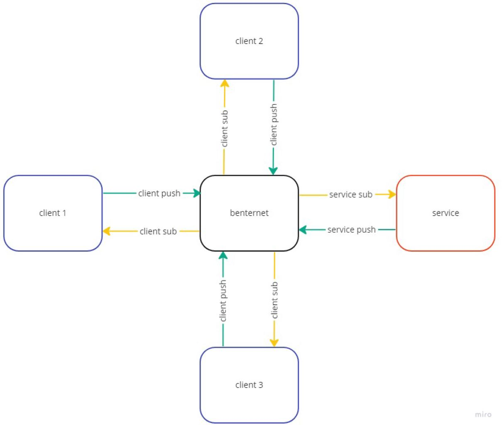

# NP_Service

In this readme you will find more information about the network service. It explains how the communication between the client and service works and how the program itself works.

# Communication

In this project there are three applications: the client, benternet and the service. 
Below you can read how they communicate with each other. All communication is done with TCP protocol.

## Client to benternet

The client is what you operate as a user, in the client you can give your commands. These commands are then sent to benternet. The client sends to benternet on port 24041.

## Benternet to Service

When benternet gets the command from the client it will sent it to all services that are connected on it on port 24042. Only the service that is listening to "shop!" will accept the command.

## Service to benternet

When the service has done his job, and has a command that need to be send back to the client, it sends the command to benternet also on port 24041.

## Benternet to client

When benternet get this command, it will also send it to all services that are connected to it on port 24042. Only the service that is listening to "shop?" will accept the command.

## Conclusion

Like you can see, both client and service application has a push and receive function. When you start up the client, it will first push a command and then start listening to receive command. While the service  will firts lissen and then push when you start it.  
Also the client and service need to listen at different subjects. Otherwise they will also get their own command when benternet is sending on port 24042

## Flowchart

# Commandos
## add
## get
## del

## Example
